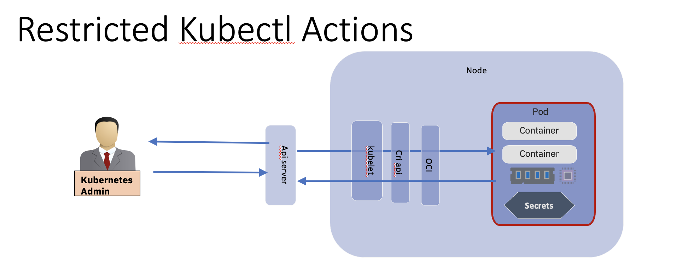
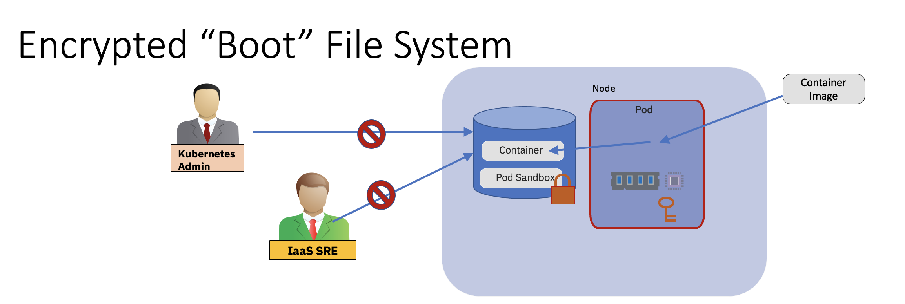
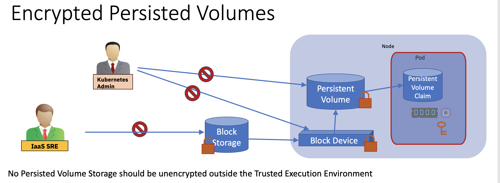
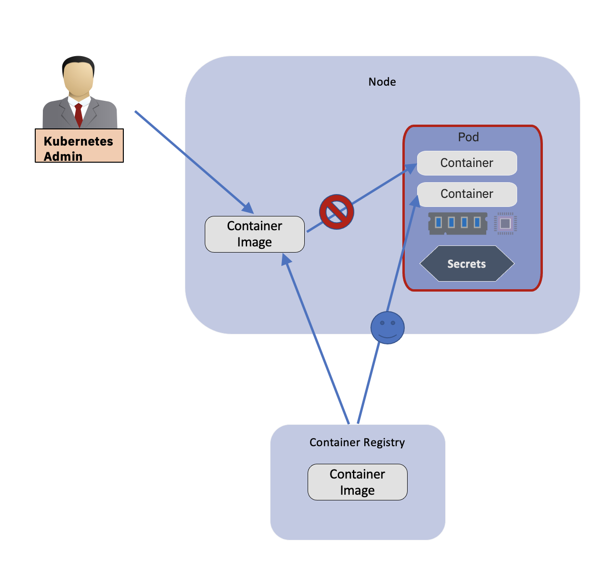

# Threat Model

For use with Threat Modelling

## Confidential Computing Threat Vector Areas

The threat vectors[^1] 5.2.1 In-Scope considered to be in-scope for Confidential Computing are 
defined within the Confidential Computing Consortium Document. The following threat vectors are 
relate to confidential containers:

- Software supply chain attacks: include the attacks on components directly associated with the protections that specific TEEs provide, as well as pre-container components running inside TEEs. These components belong to the TCB of confidential container. Any attacks that may compromise TCB can fundamentally break the security of confidential container.

- Container image attacks: include the attacks on the container image. A container image includes the tenant's sensitive workload and data, so any attacks that may compromise the container image may cause the leakage of the tenant's sensitive information.

- Control plane attacks: include the attacks on K8s and container runtime control planes (such as CRI/shim/agent API). Traditionally, tenants trust these control planes controlled by the platform owner. If a specific confidential container based solution distrusts these control planes, the storage and transport of data over these control planes needs the protections for confidentiality and integrity. In addition, the Alternately, use another control plane to protect the data, e.g, a secure and attested control plane established with remote attestation procedure. In addition, the service APIs located at the trust boundary, e.g, agent API used by kata-cc, may cause trust boundary violation, without hardening or restriction.

- Storage of data attacks: include the attacks related to the storage of data derived by confidential container. These sensitive data belong to tenants, and the confidential container must provide the protections of confidentiality and integrity.

### Threat Vectors Consider 
- Container Image Tampering

### Artifacts

#### Client Specific Data
Can be Sensitive Personal Data
This is what must be protected to fulfil compliance and Data Protection laws

#### Business Logic OCI containers
This is the value add to the customer, for the solution provider this is their value proposition

#### Side Car support Containers
These are containers not specific to one solution which provide non business logic capability. 
Examples include observability (logging,Monitoring) or service mesh capability.
These containers may be specified by the solution or desired by the solution and 
specified and provided by the  Orchestration  Administrator

#### Pod Deployment Descriptors
The desired state of pods/resources etc to offer the solution within a cloud native environment

#### Secrets
Can be associated with each of the other artifacts
- keys for decrypting containers
- signatures for verification of containers
- encryption keys for data at rest

### Components

#### Trusted Execution Environment

#### Attestation Service

#### Key Broker service

#### Orchestration Control Plane

#### Node

** Put this into a separate commit**
**How to structure / index threats?**
**Split into those covered already by ccvO and those yet to be covered?**
**Decide on convention for diagrams, consider the CCV0 progress slides (https://docs.google.
com/presentation/d/1SIqLogbauLf6lG53cIBPMOFadRT23aXuTGC8q-Ernfw/edit#slide=id.p)***
** Consider structure of threats, without CC, identify ease of exploit, impact of exploit, with 
CC show risk closed.**

### Memory Protection

Memory used by the pod/containers is visible to Infrastructure Administrator and Orchestration 
Administrator with possiblity of change.
Customer does not trust the Adminitsrtators with their data.

Use TEE's with Administrators outside the TEE, data only accessible in memory inside.

### Executable apis

kubeadmn can exec into a running container
This would circumvent the memory protection and break confidential computing and must not be 
allowed.

Repeat threat for individual possible kubectl calls

### Encrypted Boot File System

The pod may require a file system as a boot volume, if so this file system must be encrypted so 
it can only be accessed within the TEE environment.

### Encrypted Persistent Volumes

Pods live and die but data in persistent volumes is not ephemeral and has independant life cycle 
to a pod. The data on such a volume must still be protected outside a TEE.

### Container Delivery

Kubernetes Admin and node(host) should not be able to interfere with the delivery of containers 
into the pod and TEE environment.

## Reference

- [OWASP Threat Modelling Cheat Sheet](https://cheatsheetseries.owasp.org/cheatsheets/Threat_Modeling_Cheat_Sheet.html)
---
